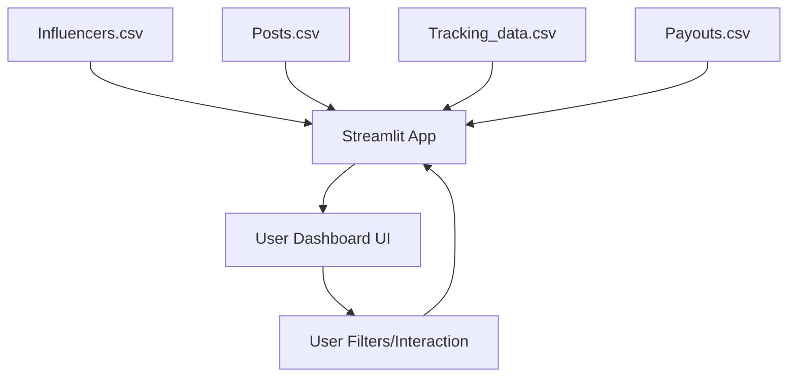

# HealthKart Influencer ROI Dashboard

## Objective
A Streamlit-based open-source dashboard to track and visualize the return on investment (ROI) of influencer marketing campaigns. The dashboard calculates and displays key metrics like Return on Ad Spend (ROAS), Incremental ROAS, and provides actionable insights into influencer performance.

## Setup Instructions
1. **Install dependencies:**
   ```bash
   pip install streamlit pandas numpy plotly faker
   ```
2. **Generate sample data:**
   ```bash
   python scripts/generate_data.py
   ```
3. **Run the dashboard:**
   ```bash
   streamlit run app.py
   ```

## Assumptions Made
- **Incremental ROAS Calculation:**
  - Baseline revenue is defined as the average daily revenue from non-influencer sources (`organic`, `paid_ad`).
  - Incremental Revenue = Total Influencer Revenue - (Baseline Daily Revenue × Number of Campaign Days)
  - Incremental ROAS = Incremental Revenue / Total Payout
- **Data Simulation:**
  - Influencer, post, tracking, and payout data are randomly generated to mimic realistic campaign scenarios.
  - Some revenue is always attributed to non-influencer sources to enable incrementality analysis.

## Dashboard Features
- **Sidebar Filters:** Filter by Brand/Product, Platform, Influencer Category, and Analysis Period (date range).
- **KPI Section:** Displays Total Revenue, Total Spend, Overall ROAS, and Overall Incremental ROAS.
- **Visualizations:**
  - Top 5 Influencers by ROAS (bar chart)
  - Top 5 Influencers by Revenue (bar chart)
  - Table of Influencers with Poor ROI (ROAS < 1)
  - Revenue Over Time by Source (line chart)
- **Detailed Data View:** Searchable, sortable influencer summary table.
- **Download:** Export filtered data as CSV.

## System Design Diagram


---

For any questions or suggestions, please contact the project maintainer.
