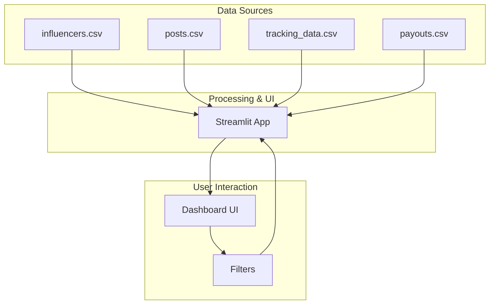

# HealthKart Influencer ROI & Performance Analytics Dashboard

[](https://influroas.streamlit.app/)

A dynamic, open-source dashboard to track and visualize the return on investment (ROI) of influencer marketing campaigns. This tool calculates key metrics like Return on Ad Spend (ROAS), Incremental ROAS, and provides actionable insights into influencer performance.

**[➡️ View Live Demo](https://influroas.streamlit.app/)**

---

## 🚀 Key Features
- **📊 Interactive KPI Dashboard:** Get a real-time overview of total revenue, spend, overall ROAS, and incremental ROAS.
- **✂️ Advanced Filtering:** Segment data by brand, product, platform, influencer category, and custom date ranges.
- **🏆 Performance Analysis:** Identify top-performing influencers by ROAS and revenue, and flag underperforming campaigns (ROAS < 1).
- **📈 Trend Visualization:** Analyze revenue over time, split by source (influencer vs. baseline), to understand campaign impact.
- **📥 Data Export:** Download filtered summary data as a CSV for further analysis.
- **🎨 Modern UI:** A sleek, dynamic, and responsive user interface built for a great user experience.

---

## 🛠️ Setup & Run Locally
1. **Clone the repository:**
   ```bash
   git clone https://github.com/vijayshreepathak/Influencer-Performance-ROAS-Analyzer.git
   cd Influencer-Performance-ROAS-Analyzer
   ```
2. **Install dependencies:**
   ```bash
   pip install -r requirements.txt
   ```
3. **Generate sample data (optional, included in repo):**
   ```bash
   python scripts/generate_data.py
   ```
4. **Run the dashboard:**
   ```bash
   streamlit run app.py
   ```

---

## 🧠 Core Metric Formulas

### Return on Ad Spend (ROAS)
ROAS measures the gross revenue generated for every rupee spent on an influencer.

$ROAS = \\frac{\\text{Total Revenue from Influencer}}{\\text{Total Payout to Influencer}}$

### Incremental ROAS
Incremental ROAS measures the efficiency of influencer spend at generating revenue *above* a baseline of organic/paid channels. This helps determine the true value-add of the influencer.

**1. Baseline Revenue:**
   $Baseline\\ Daily\\ Revenue = \\text{Average daily revenue from non-influencer sources ('organic', 'paid_ad')}$

**2. Incremental Revenue:**
   $Incremental\\ Revenue = \\text{Total Influencer Revenue} - (\\text{Baseline Daily Revenue} \\times \\text{Number of Campaign Days})$

**3. Incremental ROAS:**
   $Incremental\\ ROAS = \\frac{\\text{Incremental Revenue}}{\\text{Total Payout}}$

---

## 🏗️ System Design


---

Made with ❤️ by **Vijayshree Vaibhav** | 7x hackathon winner | [LinkedIn](https://www.linkedin.com/in/vijayshreevaibhav/) | [Portfolio](https://vijayshreepathak.netlify.app/)
